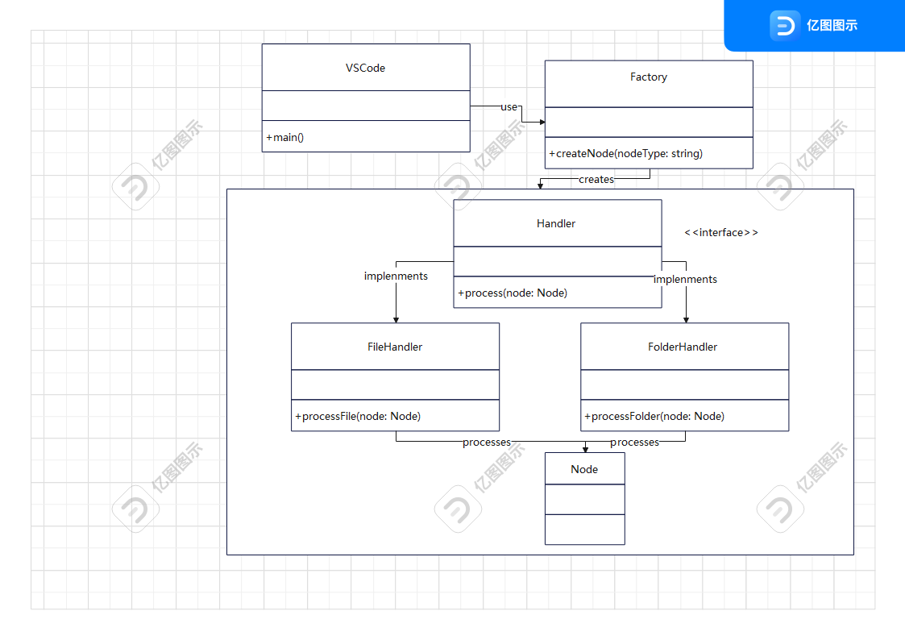
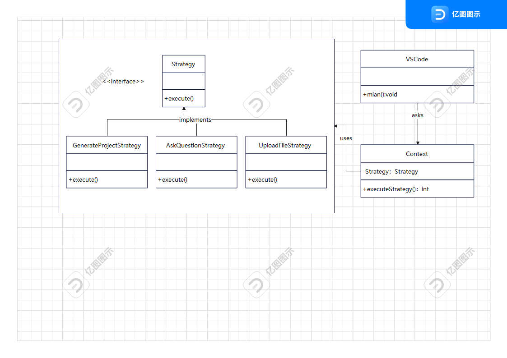

# ChiikaCode 赵会洋个人文档

## 1.项目背景

ChiikaCode VSCode 插件旨在通过 AI 编程助手功能提升开发效率。本插件通过与后端交互，提供代码生成功能、项目生成、文件上传等能力。

我在Chiikawa小组中的主要工作是解析项目中的前端设计模式、前端二次开发。

## 2.具体工作

### 2.1. 前端架构、设计模式

在ChiikaCode插件的前端架构中，我们采取了模块化、事件驱动的设计方式，以确保插件的可扩展性和可维护性。插件的前端通过与后端的RESTful接口进行交互，同时使用了多种设计模式来保证代码的高效性和灵活性。

#### 2.1.1. 观察者模式实例

```js
webviewView.webview.onDidReceiveMessage(async message => {
    await this.handleMessage(message, webviewView);
});
```


在这里，`onDidReceiveMessage`监听从前端发来的消息，当接收到消息后执行`handleMessage`方法，更新UI或者执行相应的后台逻辑。每次用户在Webview中交互时，都会触发这个监听器。

#### 2.1.2. 工厂模式实例

```js
if (nodeType === 'folder') {
    const absoluteFolderPath = vscode.Uri.file(`${workspacePath}/${currentPath}`);
    await vscode.workspace.fs.createDirectory(absoluteFolderPath);
    if (node.children && Array.isArray(node.children)) {
        for (const childNode of node.children) {
            await this.processNode(childNode, workspacePath, currentPath);
        }
    }
} else if (nodeType === 'code' || nodeType === 'file') {
    const content = node.content || '';
    const absoluteFilePath = vscode.Uri.file(`${workspacePath}/${currentPath}`);
    const fileFolder = absoluteFilePath.with({ path: absoluteFilePath.path.split('/').slice(0, -1).join('/') });

    await vscode.workspace.fs.createDirectory(vscode.Uri.file(fileFolder.path));
    const edit = new vscode.WorkspaceEdit();
    edit.createFile(absoluteFilePath, { overwrite: true });
    edit.set(absoluteFilePath, [
        new vscode.TextEdit(new vscode.Range(0, 0, 0, 0), content)
    ]);
    await vscode.workspace.applyEdit(edit);
}
```

这段代码是文件生成和目录创建的核心逻辑。根据nodeType判断是文件还是文件夹，并通过不同的方式来处理它们。这是典型的工厂模式，每种类型的数据（文件或文件夹）都有不同的处理策略。



#### 2.1.3. 策略模式实例

```js
switch (message.command) {
    case 'generateProject':
        // 生成项目的策略
        break;
    case 'askQuestion':
        // 提问的策略
        break;
    case 'uploadFile':
        // 上传文件的策略
        break;
    default:
        // 其他默认策略
        break;
}
```

根据不同的`command`值，选择不同的策略来处理。每种策略都封装了特定的业务逻辑，使得系统可以灵活地扩展。



#### 2.1.4. 单例模式

在插件中，`NewViewProvider` 类采用了单例模式的设计。`viewType` 是该类的静态常量，它在VS Code中只会被实例化一次。这个模式确保了只有一个实例处理所有的Webview交互。

### 2.2. 前端算法设计

在ChiikaCode插件中，前端的算法设计主要集中在以下几个方面：

#### 2.2.1. 项目生成与文件创建

在ChiikaCode插件的前端开发中，项目生成和文件创建是核心功能之一。这个部分的算法设计关注于如何根据后端返回的数据（通常是一个包含目录和文件结构的JSON对象），递归地创建文件夹和文件。

##### 深度优先遍历（DFS）

为了生成整个项目结构，我们通常需要递归地遍历每一个节点。在这种情况下，项目结构中可能包含文件夹和文件，我们采用深度优先遍历（DFS）方法来逐一访问每个节点。
每个节点会携带该文件或文件夹的相关信息，比如文件名、类型（文件或文件夹）、内容（对于文件来说是其内容，对于文件夹来说是其子节点）。
DFS遍历确保了文件夹结构和内容能够按正确的顺序创建。首先创建目录，接着在目录下创建文件。如果目录中还有子目录或文件，则继续递归创建。

假如有以下项目结构

```markdown
Project
│
├── folder1
│   ├── file1.js
│   └── folder2
│       └── file2.js
└── file3.js
```

- DFS遍历过程

1. 首先，遍历到 `Project` 文件夹。
2. 然后进入 `folder1` 文件夹，继续遍历。
3. 在 `folder1` 内，首先遇到 `file1.js`，创建该文件。
4. 接着进入 `folder2` 文件夹，再遍历其中的 `file2.js`。
5. 最后，回到 `Project` 文件夹，创建 `file3.js`。

- 路径创建

使用 `vscode.Uri` 创建路径，并调用 `createDirectory()` 或 `createFile()`。

```lua
              +------------------------+
              |        Project          |
              +------------------------+
                     /        \
        +-----------------+    +-----------------+
        |    folder1      |    |     file3.js    |
        +-----------------+    +-----------------+
               /     \
      +-------------+   +---------------+
      |   file1.js  |   |    folder2     |
      +-------------+   +---------------+
                           |
                      +-----------+
                      |  file2.js |
                      +-----------+
```

##### 使用`vscode.Uri`进行路径管理

为了确保每个文件和文件夹的路径都是准确无误的，我们使用了`vscode.Uri` API来处理路径的拼接和管理。
`vscode.Uri.file(path)`方法可以生成一个URI对象，用于表示文件路径，确保路径格式与文件系统兼容。
例如，在创建文件夹时，我们先生成文件夹的URI，然后通过`vscode.workspace.fs.createDirectory()`方法创建目录。如果是文件，则通过`vscode.workspace.fs.createFile()`来创建文件并写入内容。

##### 根据节点类型选择创建方法

在遍历项目结构时，我们根据每个节点的类型（文件夹或文件）来调用不同的创建方法。对于文件夹，我们只需要调用`createDirectory()`；对于文件，则需要通过`createFile()`和后续的`WorkspaceEdit`操作来创建文件并填充内容。

##### 递归创建目录和文件

当遇到一个文件夹节点时，系统会首先检查该文件夹是否已存在，如果不存在则创建它。创建文件夹后，系统会继续递归处理该文件夹中的子节点。如果节点是文件，则会创建该文件并写入内容，文件创建的路径也是递归生成的。

#### 2.2.2. 消息处理机制

前端通过`onDidReceiveMessage`和`window.addEventListener('message')`监听来自后端的消息，并通过解析不同的消息命令来选择合适的处理逻辑。算法设计中需要考虑消息的高效分发与处理，保证用户交互的流畅性。

#### 2.2.3. UI更新与数据绑定

在处理完后端请求并收到响应后，前端需要通过事件驱动机制更新UI。我们使用了原生的JavaScript事件机制，并结合前端框架（如HTML的DOM事件），来确保UI在收到数据后及时渲染。例如，生成的代码会通过`responseContainer`动态展示，用户交互后会即时反映到UI上。

## 3. 个人收获与反思

在参与 ChiikaCode 插件的开发过程中，我深刻体会到了前端开发中设计模式应用的重要性。通过解析和应用多种设计模式（如观察者模式、工厂模式、策略模式等），我不仅提升了自己的技术能力，也对如何在实际项目中解决复杂问题有了更深入的理解。

### 3.1 技术提升

1. **设计模式的实际应用**  
   通过将设计模式应用到实际开发中，我学会了如何根据需求灵活选择合适的模式，并在具体问题中找到最优解。例如，在项目生成和文件创建过程中，我通过使用工厂模式来简化节点类型的处理，避免了大量重复的代码。

2. **前后端交互的优化**  
   在实现前后端数据交互的过程中，我提高了如何高效设计消息处理机制的能力。通过使用事件驱动机制（如 `onDidReceiveMessage` 和 `window.addEventListener('message')`），我确保了前端能够实时响应后端的请求，提升了用户体验。

3. **文件和路径管理**  
   对于复杂的文件创建和路径管理，我深入理解了如何使用 `vscode.Uri` 来确保文件路径的准确性。尤其是在处理递归创建文件夹和文件时，如何确保每一步路径的正确拼接，避免了因路径错误导致的潜在问题。

### 3.2 团队合作与沟通

在团队中与其他成员的合作也让我意识到良好的沟通与协作对于项目成功的重要性。在开发过程中，我与后端和设计团队进行了紧密的沟通，确保插件的功能与需求能够无缝对接。通过这种跨职能的协作，我不仅学会了如何表达自己的技术方案，也更加理解了团队中每个角色的工作流程。

### 3.3 持续优化的意识

开发过程中，我发现了插件的一些性能瓶颈和潜在的用户体验改进点。例如，在处理大量文件创建时，如何提高处理效率和减少UI卡顿是我需要关注的重点。未来，我将更加注重代码的优化与性能提升，特别是在数据量较大时，如何保持应用的流畅性和稳定性。

### 3.4 自我反思

1. **时间管理和任务分配**  
   在项目开发的过程中，我有时会过于关注细节，导致某些阶段的开发进度有所延迟。通过这次经历，我学会了更好地平衡细节与大局，合理规划任务优先级，确保按时完成每个开发周期的目标。

2. **技术深度的挖掘**  
   尽管我在前端开发中积累了较多的经验，但在一些高级概念的应用（如复杂的算法设计、性能优化）上，我仍有提升的空间。我将继续通过学习和实践，深入掌握前端技术栈的各个方面，提升自己在复杂场景下的解决能力。

总的来说，ChiikaCode 项目的开发不仅让我在技术上获得了提升，还在团队合作和项目管理方面积累了宝贵经验。通过不断的反思和总结，我期待自己在未来的开发工作中能够更加高效、灵活地解决问题，为团队和项目做出更大贡献。
