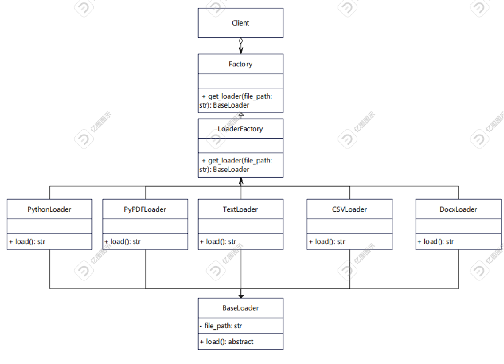
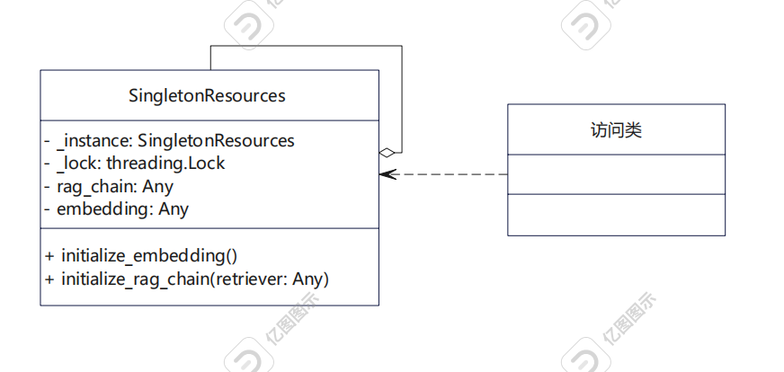

# ChiikaCode 二次开发详细设计报告

ChiikaCode是一个利用RAG（Retrieval-Augmented Generation）进行工程级代码生成的VS Code插件，旨在通过集成后端API来实现项目的自动化生成、文件上传与处理、以及自动化提问等功能。以下是项目的设计和实现概述：

## 一、前端工程级别代码生成功能部分

### 1.1. 插件设计与架构

VS Code 插件的核心目标是为用户提供一个直观的界面，支持生成项目代码、上传文件与文件夹、以及通过提问与后端交互。设计上采用了VS Code的Webview API，后端通过HTTP请求响应插件前端。

#### 主要组件

- **Webview**：前端UI由Webview承载。UI包括语言选择、项目需求输入框、函数名与参数输入框、以及多个交互按钮（生成项目、生成代码、提问、上传文件等）。
- **后端交互**：插件与本地后端服务通过HTTP请求进行数据交互，执行代码生成、项目生成等操作。后端服务通常提供RESTful接口，如生成项目、生成代码、回答问题、文件上传等。
- **文件系统操作**：通过VS Code API操作工作区文件系统，创建目录、写入文件，甚至上传文件和文件夹。

#### 工作流程

1. 用户在插件UI中选择编程语言、输入项目需求或代码生成相关信息。
2. 前端通过`postMessage`向后端发送请求，后端根据请求生成项目或代码并返回结果。
3. 如果涉及文件上传，前端会获取文件路径或文件夹路径，通过HTTP上传到后端进行处理。
4. 后端处理完成后，前端显示相应的结果或代码，用户可以在VS Code中查看、编辑和保存。

### 1.2. 插件设计与架构

#### 1.2.1. 观察者模式

在此项目中，`onDidReceiveMessage` 和 `window.addEventListener('message')` 便是典型的观察者模式应用。前端UI通过事件监听机制接收后端返回的消息，并在接收到消息后更新UI。具体表现为：

- `webviewView.webview.onDidReceiveMessage` 用于监听用户与Webview交互的消息。
- `window.addEventListener('message')` 监听后端消息并更新UI，例如生成的代码、上传结果等。

这种模式使得前端与后端解耦，消息的发送者（后端或前端）与接收者（前端UI）不需要直接引用彼此。

#### 1.2.2. 工厂模式

在文件创建和保存的部分，使用了工厂模式来生成文件。具体的实现体现在`saveGeneratedFiles`和`processNode`方法：

- `processNode`方法根据传入的`nodeType`来决定是创建文件还是文件夹。文件夹会调用`createDirectory`方法，文件则通过`WorkspaceEdit`来创建文件并写入内容。这是工厂模式的一种实现，动态生成不同类型的文件或文件夹。

#### 1.2.3. 策略模式

在处理不同类型的请求时，策略模式应用在`handleMessage`方法中。不同的命令（如`generateProject`、`askQuestion`、`uploadFile`等）有不同的处理策略。根据消息中的`command`字段，选择相应的处理方法来执行：

- 生成项目：调用`generateProject`接口。
- 提问：调用`askQuestion`接口。
- 上传文件：调用`uploadFile`接口。
- 生成代码：调用`generateCode`接口。
  
这种方式可以将不同的处理逻辑封装到独立的策略中，便于扩展和维护。

#### 1.2.4. 单例模式

在插件中，`NewViewProvider` 类采用了单例模式的设计。`viewType` 是该类的静态常量，它在VS Code中只会被实例化一次。这个模式确保了只有一个实例处理所有的Webview交互。

### 1.3. 实例分析

#### 1.3.1. 观察者模式实例

```js
webviewView.webview.onDidReceiveMessage(async message => {
    await this.handleMessage(message, webviewView);
});
```


在这里，`onDidReceiveMessage`监听从前端发来的消息，当接收到消息后执行`handleMessage`方法，更新UI或者执行相应的后台逻辑。每次用户在Webview中交互时，都会触发这个监听器。

#### 1.3.2. 工厂模式实例

```js
if (nodeType === 'folder') {
    const absoluteFolderPath = vscode.Uri.file(`${workspacePath}/${currentPath}`);
    await vscode.workspace.fs.createDirectory(absoluteFolderPath);
    if (node.children && Array.isArray(node.children)) {
        for (const childNode of node.children) {
            await this.processNode(childNode, workspacePath, currentPath);
        }
    }
} else if (nodeType === 'code' || nodeType === 'file') {
    const content = node.content || '';
    const absoluteFilePath = vscode.Uri.file(`${workspacePath}/${currentPath}`);
    const fileFolder = absoluteFilePath.with({ path: absoluteFilePath.path.split('/').slice(0, -1).join('/') });

    await vscode.workspace.fs.createDirectory(vscode.Uri.file(fileFolder.path));
    const edit = new vscode.WorkspaceEdit();
    edit.createFile(absoluteFilePath, { overwrite: true });
    edit.set(absoluteFilePath, [
        new vscode.TextEdit(new vscode.Range(0, 0, 0, 0), content)
    ]);
    await vscode.workspace.applyEdit(edit);
}
```

这段代码是文件生成和目录创建的核心逻辑。根据nodeType判断是文件还是文件夹，并通过不同的方式来处理它们。这是典型的工厂模式，每种类型的数据（文件或文件夹）都有不同的处理策略。


#### 1.3.3. 策略模式实例

```js
switch (message.command) {
    case 'generateProject':
        // 生成项目的策略
        break;
    case 'askQuestion':
        // 提问的策略
        break;
    case 'uploadFile':
        // 上传文件的策略
        break;
    default:
        // 其他默认策略
        break;
}
```

根据不同的`command`值，选择不同的策略来处理。每种策略都封装了特定的业务逻辑，使得系统可以灵活地扩展。


#### 1.3.4. 单例模式

在插件中，`NewViewProvider` 类采用了单例模式的设计。`viewType` 是该类的静态常量，它在VS Code中只会被实例化一次。这个模式确保了只有一个实例处理所有的Webview交互。

### 1.4. 前端分析结语

ChiikaCode插件的设计考虑了用户体验与后端处理的分离，采用了多种设计模式来确保系统的高扩展性和低耦合度。通过合理地应用观察者模式、工厂模式、策略模式和单例模式，该插件能够有效地处理不同类型的用户交互，并与后端系统实现无缝的集成。

## 二、后端API设计

### 2.1 整体设计架构

#### 2.1.1 项目生成

一个基于 FastAPI 的 Web 服务，用于根据用户的需求生成指定编程语言的代码结构，并结合知识库生成实际的代码文件。它主要包括以下几个部分：

1. **FastAPI 应用初始化**：使用 `FastAPI` 框架创建 Web 应用，并定义了一个 `/generate` POST 路由，用于接收用户请求，生成代码结构和文件。

2. **请求体数据模型**`RequestData` 类继承自 `BaseModel`，定义了请求体的数据模型，包含两个字段：

   - `question`: 用户提供的问题或需求，用来描述生成代码的要求。

   - `language`: 用户希望生成代码的编程语言。

3. **生成代码的核心流程**

      - **`generate_code_structure`** 函数：
        - 该函数的作用是根据用户输入的问题 (`question`) 和编程语言 (`language`)，生成项目代码的结构。
        - 它首先通过 `getRawStructureStream` 获取项目结构信息，然后使用 `parseStructureString` 解析该结构信息，得到 `Node` 对象。
        - `Node` 对象代表了项目的结构，函数遍历项目中的所有文件节点（通过 `getFileNodes` 获取），并生成对应的代码内容。
        - 代码生成后会被保存到对应的节点对象中，并最终返回项目结构的 JSON 格式。

      - **`getRawCodeStream`** 函数：
        - 该函数根据用户需求、代码结构、文件名和语言生成大模型的原始字符流，调用了 `RunnablePassthrough` 进行流式数据传递，最后使用 `StrOutputParser` 解析模型的输出。
        - 在这个流程中，模板被传入到一个 `ChatPromptTemplate` 中，然后通过链式调用生成响应。

4. **支持的操作**

      - 使用 `get_embedding` 获取嵌入数据，结合 `get_vector_db` 和 `build_retriever` 构建检索系统，这样可以在生成代码时参考知识库的数据。

      - 通过 `langchain` 框架，使用 LLM（如 GPT 模型）生成代码内容。

      - 代码生成后会被存储为 JSON 格式的结构，并保存到本地文件 `result.json`。

5. **异常处理**
      - 在生成代码的过程中，如果遇到错误，会抛出 HTTP 异常并返回给用户，状态码为 `500` 或 `400`。

6. **API端点**`/generate_code`:

   - 接收 `POST` 请求，参数是用户提供的需求 (`question`) 和编程语言 (`language`)。

   - 如果语言不在支持的列表中，返回 `400` 错误。

   - 调用 `generate_code_structure` 来生成项目代码结构并返回结果。

7. **启动 FastAPI 服务**

      - 在 `startup_event` 中打印 "FastAPI 服务已启动..."，表示 FastAPI 服务已经成功启动。

      - 通过 `uvicorn.run()` 启动服务，监听 `0.0.0.0:8000`，这意味着服务将会在本地端口 8000 上运行。

#### 2.1.2 Rag 构建

允许用户上传文件或文件夹，并使用 RAG（Retrieval-Augmented Generation）链回答用户提出的问题并根据知识库生成项目级代码。

1. **文件加载与处理**：

      - 提供多种文件加载器（如 Python、PDF、TXT、CSV、DOCX、XLSX 等），支持读取不同类型的文件内容。

      - 对文件内容进行分割，使用 `RecursiveCharacterTextSplitter` 将文本分成合适的块，以便后续处理。

2. **嵌入和向量数据库**：

      - 使用 `HuggingFaceBgeEmbeddings` 获取文本的嵌入向量。

      - 将处理后的文档向量存储到 Chroma 向量数据库中，支持从数据库中检索相关信息。

3. **RAG（Retrieval-Augmented Generation）链**：
      - 构建一个 RAG 链，将检索到的上下文与用户的问题结合，利用 `ChatOllama` 模型生成答案。

4. **API 路由**：

      - **`/upload_file_path`**：上传文件或文件夹路径，处理文件内容并初始化 RAG 链。

      - **`/rag_ask`**：向 RAG 链提问，基于已上传的文件内容生成答案。

5. **文件夹处理**：如果上传的是文件夹，递归遍历文件夹中的文件，处理所有支持的文件类型并更新向量数据库。

#### 2.1.3 函数级可运行代码生成

该模块提供了一个接口函数 `getExecutable`，参数为：

- `functionName`：函数名
- `arguements`：函数参数列表
- `docString`：函数文档字符串

返回值是：

- `code`：生成的函数字符串，并且保证生成的函数可以正常运行

用户可以通过输入期望生成的函数名、函数说明注释以及函数参数列表，来自动补全函数的功能实现。

**实现原理：**

通过 OpenAI 模型（如 `starcoder2:3b`）生成 Python 函数的代码，并确保生成的代码没有语法错误且可执行。用户提供函数名、参数和文档字符串，服务返回一个符合要求的可执行 Python 代码。

1. **请求与响应模型**：
      - **`CodeRequest`**：定义了请求体，包含：
        - `function_name`：函数名。
        - `arguments`：函数参数列表。
        - `doc_string`：函数的文档字符串（功能说明）。
        - **`CodeResponse`**：定义了响应体，返回生成的代码字符串。

2. **核心代码生成逻辑**：

- **`getCompleteBody`**：根据给定的前缀和后缀生成补全的函数体，调用 `ollama.generate` 完成代码生成。
  
- **`getOriginalCode`**：通过函数名、参数和文档字符串生成初始的函数代码。它首先生成函数体，然后结合文档字符串构建完整的函数。
  
- **`getTestCode`**：为生成的函数代码创建一个简单的测试代码框架。
  
- **`getNoErrorCode`**：尝试生成没有语法错误的函数代码。如果有语法错误，会重新生成，直到代码没有错误为止。
  
- **`getExecutable`**：生成可执行的函数代码。通过生成的函数代码创建测试代码并执行，尝试最多10次生成成功的可运行代码。

3. **API 路由**：
      - **`/generate_executable_code`**：接收一个 `CodeRequest` 请求，调用 `getExecutable` 生成符合要求的代码，并返回生成的代码。

4. **生成代码的策略**：

      - 尝试生成语法正确的代码，直到没有语法错误。

      - 尝试生成10次可运行的测试代码，如果生成的测试代码通过测试，认为生成的函数代码是可执行的。

#### 2.1.4 基于 streamlit 的交互原型设计

由于前端和后端非同步开发，因此在开发后端过程中，使用 streamlit 库进行原型设计，用于测试代码功能，方便调式代码和发现 bug。

### 2.2 设计模式分析

#### 2.2.1.工厂模式

**代码分析**

在本项目代码中，`LoaderFactory` 类就是一个典型的工厂模式实现。它根据文件的扩展名返回不同的文件加载器对象。

1. **`BaseLoader` 类**：
   - **属性**：
     - `file_path`：文件路径。
   - **方法**：
     - `load()`：抽象方法，需要在子类中实现。

2. **具体加载器类**：
   - **`PythonLoader`、`PyPDFLoader`、`TextLoader`、`CSVLoader`、`DocxLoader`、`XlsxLoader`、`CLoader`、`JavaLoader`、`CPPLoader`**：
     - **继承自**：`BaseLoader`。
     - **方法**：
       - `load()`：实现具体的文件加载逻辑。

3. **`LoaderFactory` 类**：
   - **静态方法**：
     - `get_loader(file_path: str)`：根据文件扩展名返回相应的加载器对象。

```python
class BaseLoader:
    def __init__(self, file_path):
        self.file_path = file_path
    def load(self):
        raise NotImplementedError("This method should be overridden by subclasses")

class PythonLoader(BaseLoader):
    def load(self):
        with open(self.file_path, 'r', encoding='utf-8') as file:
            return file.read()
class PyPDFLoader(BaseLoader):
    def load(self):
        return extract_text(self.file_path)
class TextLoader(BaseLoader):
    def load(self):
        with open(self.file_path, 'r', encoding='utf-8') as file:
            return file.read()
class CSVLoader(BaseLoader):
    def load(self):
        with open(self.file_path, newline='', encoding='utf-8') as csvfile:
            reader = csv.reader(csvfile)
            return list(reader)
class DocxLoader(BaseLoader):
    def load(self):
        doc = DocxDocument(self.file_path)
        full_text = []
        for para in doc.paragraphs:
            full_text.append(para.text)
        return '\n'.join(full_text)
class XlsxLoader(BaseLoader):
    def load(self):
        workbook = load_workbook(filename=self.file_path)
        sheet = workbook.active
        data = []
        for row in sheet.iter_rows(values_only=True):
            data.append(row)
        return data
class CLoader(BaseLoader):
    def load(self):
        with open(self.file_path, 'r', encoding='utf-8') as file:
            return file.read()
class JavaLoader(BaseLoader):
    def load(self):
        with open(self.file_path, 'r', encoding='utf-8') as file:
            return file.read()
class CPPLoader(BaseLoader):
    def load(self):
        with open(self.file_path, 'r', encoding='utf-8') as file:
            return file.read()
# 定义 LoaderFactory 工厂类
class LoaderFactory:
    @staticmethod
    def get_loader(file_path):
        if file_path.endswith('.py'):
            return PythonLoader(file_path)
        elif file_path.endswith('.pdf'):
            return PyPDFLoader(file_path)
        elif file_path.endswith('.txt'):
            return TextLoader(file_path)
        elif file_path.endswith('.csv'):
            return CSVLoader(file_path)
        elif file_path.endswith('.docx'):
            return DocxLoader(file_path)
        elif file_path.endswith('.xlsx'):
            return XlsxLoader(file_path)
        elif file_path.endswith('.c'):
            return CLoader(file_path)
        elif file_path.endswith('.java'):
            return JavaLoader(file_path)
        elif file_path.endswith('.cpp'):
            return CPPLoader(file_path)
        else:
            print("不支持的文件类型")
            return None
```

**类图**



#### 2.2.2 单例模式

**相关代码**

在项目代码中，`SingletonResources` 类是一个典型的单例模式实现。它确保 `embedding` 和 `rag_chain` 只有一个实例，并提供了全局访问点。

**`SingletonResources` 类**：

- **属性**：
  - `_instance`：单例实例。
  - `_lock`：线程锁，确保多线程环境下的安全。
  - `rag_chain`：RAG 链实例。
  - `embedding`：嵌入向量实例。
- **方法**：
  - `__new__(cls)`：重写 `__new__` 方法，确保只有一个实例。
  - `initialize_embedding()`：初始化嵌入向量。
  - `initialize_rag_chain(retriever: Any)`：初始化 RAG 链。

```python
# 定义单例类用于管理 RAG 链和嵌入向量
class SingletonResources:
    _instance = None
    _lock = threading.Lock()

    def __new__(cls):
        if not cls._instance:
            with cls._lock:
                if not cls._instance:
                    cls._instance = super(SingletonResources, cls).__new__(cls)
                    cls._instance.rag_chain = None
                    cls._instance.embedding = None
        return cls._instance

    def initialize_embedding(self):
        if not self.embedding:
            self.embedding = get_embedding()  # 调用现有的 get_embedding 函数

    def initialize_rag_chain(self, retriever):
        if not self.rag_chain:
            self.rag_chain = build_rag_chain(retriever)  # 调用现有的 build_rag_chain 函数
```

**类图**



#### 2.2.3 观察者模式

观察者模式实例：


类图：


在 **streamlit** 库的框架下，所有的持久的变量都需要通过 **session state** 储存。基于这个框架，在观察者模式中，设计了两个接口：`Oberver` 和 `Subject`。并实现了具体的 `SessionStateObserver` 和 `SesstionStateSubject` 类。

1. 将业务逻辑拆成两部分： 代码的核心功作为主题，管理 **session state** 的内容；前端显示的代码则将转化为一组观察者类，订阅 **session state**，通过 **session state** 的变化来更新界面。
2. 声明观察者接口。 该接口声明一个 `update` 方法。
3. 主题定义了一些接口来在列表中添加和删除观察者。
4. 创建具体主题类。 每次主题发生了重要事件时都必须通知所有的观察者。
5. 客户端必须生成所需的全部观察者， 并在相应的主题中完成注册工作

**优点：**

- 观察者列表是动态的， 因此观察者可随时加入或离开该列表。
- 开闭原则，无需修改主题代码就能引入新的观察者类。
- 可以在运行时建立对象之间的联系。

**缺点：**

- 观察者的通知顺序是随机的。
- 设计模式会增加代码的复杂性。

#### 2.2.4 代理模式

代理模式实例：（服务端已经打包成可执行文件，因此这里只展示客户端代码）


类图：


ollama 将代码补全接口封装成代理模式以供不同程序进行调用。当用户需要使用代码补全功能获得补全的代码时，只要向服务端发送请求，并等待服务端响应即可。

这样可以实现延迟初始化（虚拟代理）。如果使用本地运行代码补全模型，模型的初始化需要消耗较多系统资源， 一直保持该对象运行会消耗系统资源时， 此时使用代理模式自动进行系统资源管理。

**优点：**

- 你可以在客户端毫无察觉的情况下控制服务对象。
- 如果客户端对服务对象的生命周期没有特殊要求， 你以对生命周期进行管理。
- 即使服务对象还未准备好或不存在， 代理也可以正常工作。
- 开闭原则，可以在不对服务或客户端做出修改的情况下创建新代理。
- 由于采用统一的网络协议，可以提供更好的跨编程语言适配。

**缺点：**

- 服务响应可能会延迟。

#### 2.2.5 备忘录模式

备忘录模式实例：


类图：


当用户在网页上进行文字编辑、功能切换等操作时，允许用户进行撤销操作，以退回之前的编辑状态。撤销功能通过备忘录模式实现。

1. 备忘录模式将创建状态快照 （Snapshot） 的工作委派给实际状态的拥有者 `Originator` 对象。 这样其他对象就不再需要从 “外部” 复制网页的 **session state** 状态。
2. 将对象状态的副本存储在 `Memento` 对象中。 除了创建备忘录的对象外， 任何对象都不能访问备忘录的内容，即 **session state** 的内容。 其他对象必须使用受限接口与备忘录进行交互， 它们可以获取快照的元数据 （创建时间和操作名称等）， 但不能获取快照中原始对象的状态。
3. 将备忘录保存在 `Caretaker` 对象中。 由于 `Caretaker` 仅通过受限接口与备忘录互动， 故其无法修改存储在备忘录内部的状态。 同时， `Originator` 拥有对备忘录所有成员的访问权限， 从而能随时恢复其以前的状态。
4. 当用户触发撤销操作时， 历史类将从栈中取回最近的备忘录， 并将其传递给编辑器以请求进行回滚。

**优点：**

- 可以在不破坏对象封装情况的前提下创建对象状态快照。
- 可以通过让 `Caretaker` 维护 `Originator` 状态历史记录来简化代码。

**缺点：**

- 如果客户端过于频繁地创建备忘录， 程序将消耗大量内存。
- `Caretaker` 必须完整跟踪 `Originator` 的生命周期， 这样才能销毁弃用的备忘录。
- 绝大部分动态编程语言 （例如 PHP、 Python 和 Java）无法保证备忘录不会被修改。
